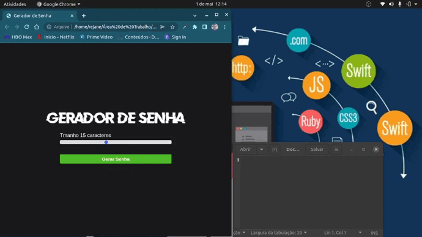

# Gerador de Senha

## Veja o desenvolvimento do projeto:

Para ver o desenvolvimento acesse o planejamento:

## Feito Com:

## 🤝 Contribuição

Projeto aberto para ajuda e sujestões!

### Support Ou Contato

Copyright © 2022 elioenaiancelmo

